# 基于卷积神经网络与迁移学习的饮料品牌 LOGO 智能分类

## 1. 课程论文来源说明

本文选题为"基于卷积神经网络的饮料品牌 LOGO 图像分类"。项目完整实现了从数据采集、模型训练到可视化评估的端到端深度学习流水线，具体来源说明如下：

**数据集来源：** 本文所使用的饮料品牌 LOGO 数据集由本人自行构建。图片采集途径包括：（1）编写 Python 百度图片爬虫脚本进行自动化批量下载；（2）从微信公众号中搜索并手动下载品牌相关图片；（3）从哔哩哔哩视频中截取包含品牌 LOGO 的帧画面；（4）本人日常生活中使用手机拍摄的实物照片。原始图片经过自动化预筛脚本（基于感知哈希去重、尺寸过滤、宽高比过滤）初步清洗后，再由本人逐张人工审核，删除无关图片，最终形成可用的标注数据集。

**代码来源：** 实验代码在大语言模型（Claude、Gemini）辅助下完成编写，本人负责整体架构设计、参数调优、实验执行和结果分析。所有代码均基于 PyTorch 深度学习框架，未直接复用任何第三方开源项目的完整代码。

**论文写作：** 论文写作过程中使用大语言模型辅助进行文字润色、结构组织和概念解释。理论部分的知识主要参考 He 等人的 ResNet 原始论文、《动手学深度学习》教材以及 PyTorch 官方文档。所有实验均由本人在本地 GPU 环境下独立完成并验证。

## 2. 摘要

随着饮料行业的快速发展，品牌数量激增，自动化的品牌 LOGO 识别技术在商业智能、广告监测和市场调研等领域具有广泛的应用前景。本文以喜茶、霸王茶姬、蜜雪冰城和瑞幸咖啡四个代表性饮料品牌为研究对象，构建了一个包含约 490 张 LOGO 图片的自建数据集，并基于 PyTorch 框架实现了两种卷积神经网络模型的对比实验。

第一个模型为从零搭建的三层 SimpleCNN 基线网络，第二个模型为基于 ImageNet 预训练权重的 ResNet50 迁移学习模型（解冻 layer3 与 layer4 进行微调）。训练过程中综合运用了标签平滑（Label Smoothing）、Mixup 数据增强、余弦退火学习率调度和早停机制等多种优化策略。

实验结果表明，SimpleCNN 在测试集上取得 61.84% 的准确率和 0.6146 的宏平均 F1 值，而 ResNet50 迁移学习模型将准确率大幅提升至 92.11%，宏平均 F1 值达到 0.9214，提升幅度超过 30 个百分点。这一结果充分验证了迁移学习在小规模数据集上的显著优势。此外，本文还开发了基于 Tkinter 的图形界面应用，支持拖拽图片进行双模型实时对比预测。

**关键词：** 卷积神经网络；迁移学习；ResNet50；图像分类；品牌识别

## 3. 引言

图像分类是计算机视觉领域最基本也是最重要的任务之一。自 2012 年 Krizhevsky 等人提出的 AlexNet 在 ImageNet 大规模视觉识别挑战赛上取得突破性成绩以来[7]，以卷积神经网络为代表的深度学习方法已经在图像分类任务上远超传统的手工特征方法，成为该领域的主流技术路线。

在众多 CNN 架构中，何恺明等人于 2015 年提出的残差网络（ResNet）是一个重要的里程碑[1]。ResNet 通过引入跳跃连接（Skip Connection）解决了深层网络训练中的退化问题，使得训练超过 100 层的网络成为可能，并在 ImageNet 竞赛中取得了冠军。ResNet 的预训练模型也因此成为迁移学习中最常用的骨干网络之一。

迁移学习的核心思想是将在大规模数据集上预训练的模型知识迁移到数据量较小的目标任务上[9]。对于本文这样仅有数百张图片的小规模数据集，从零训练一个深度网络极易过拟合，而迁移学习可以充分利用预训练模型已经学到的通用视觉特征（如边缘、纹理、形状等），大幅降低对数据量的需求。

本文选取喜茶、霸王茶姬、蜜雪冰城和瑞幸咖啡作为分类目标，这四个品牌在中国饮料市场具有很高的知名度和辨识度，且各自拥有风格迥异的品牌 LOGO，适合作为图像分类任务的研究对象。本文的主要工作包括：（1）自行构建饮料品牌 LOGO 数据集；（2）实现 SimpleCNN 基线模型与 ResNet50 迁移学习模型的对比实验；（3）使用多种评估指标进行全面的性能分析；（4）开发 GUI 图形界面进行实时预测演示。

## 4. 算法简介

本章将详细介绍本文所涉及的核心算法与理论基础，包括卷积神经网络的基本原理、残差网络 ResNet 的设计思想、迁移学习的方法论，以及训练过程中使用的各项优化技巧。

### 4.1 卷积神经网络基础

卷积神经网络（Convolutional Neural Network, CNN）是一类专门为处理具有网格状拓扑结构数据（如图像）而设计的深度神经网络[9]。CNN 的核心思想是通过局部连接和权值共享来提取输入数据的空间层次特征，从低级的边缘、纹理到高级的语义信息逐层抽象。一个典型的 CNN 由卷积层、池化层、激活函数和全连接层组成。

#### 4.1.1 卷积运算

卷积层是 CNN 的核心组件。在二维图像处理中，卷积运算使用一个可学习的卷积核（也称滤波器）在输入特征图上滑动，对局部区域进行加权求和，从而提取特定模式的特征。设输入特征图为 $\mathbf{X}$，卷积核为 $\mathbf{W}$，偏置为 $b$，则输出特征图 $\mathbf{Y}$ 的计算公式为：

$$Y(i, j) = \sum_{m=0}^{k-1} \sum_{n=0}^{k-1} X(i+m,\; j+n) \cdot W(m, n) + b$$

其中，$k$ 为卷积核的尺寸，$(i, j)$ 为输出特征图上的空间位置。每个卷积核负责检测输入中的一种特定模式（如水平边缘、垂直边缘、特定纹理等）。通过使用多个不同的卷积核，卷积层可以同时提取多种不同的特征，每个卷积核对应输出一个通道的特征图。

卷积运算具有两个重要特性：（1）**局部连接**——每个输出神经元只与输入的一个局部区域（感受野）相连，而非全连接，这大幅减少了参数数量；（2）**权值共享**——同一个卷积核在输入的所有位置使用相同的权重，使得模型具有平移不变性，即无论目标出现在图像的哪个位置，都能被同一个卷积核检测到。

在本文的 SimpleCNN 模型中，我们使用了三个卷积层，卷积核大小均为 $3 \times 3$，通道数依次为 32、64、128。采用 padding=1 的策略保持特征图的空间尺寸不变（在池化前）。

> **[此处插入图：CNN 卷积操作示意图。图中应展示一个 $3 \times 3$ 的卷积核在输入特征图上滑动并计算加权和的过程，标注输入、卷积核、输出特征图之间的对应关系。（建议使用 PPT 自行绘制）]**

#### 4.1.2 池化层

池化层（Pooling Layer）的作用是对特征图进行下采样，在降低特征图空间分辨率的同时保留最显著的特征信息。池化操作可以减少后续层的计算量和参数数量，并在一定程度上增强模型对输入平移和微小形变的鲁棒性。

最常用的池化方式是最大池化（Max Pooling）：在一个固定大小的窗口（如 $2 \times 2$）内取最大值作为输出。其数学表达为：

$$Y(i, j) = \max_{0 \le m < s,\; 0 \le n < s} X(i \cdot s + m,\; j \cdot s + n)$$

其中 $s$ 为池化窗口的大小和步长。以 $2 \times 2$ 最大池化为例，每次操作将特征图的宽和高各缩小一半，使得数据量减少为原来的四分之一。

另一种常用的池化方式是全局平均池化（Global Average Pooling, GAP），它对每个通道的整个特征图取平均值，将任意大小的特征图压缩为一个标量。本文的 SimpleCNN 模型使用了自适应平均池化（AdaptiveAvgPool2d），将特征图统一压缩到 $4 \times 4$ 的尺寸，确保无论输入图片的原始尺寸如何，都能得到固定大小的特征向量。

#### 4.1.3 激活函数

激活函数为神经网络引入非线性变换能力。如果没有激活函数，无论堆叠多少层线性变换，整个网络仍然等价于一个单层线性模型，无法拟合复杂的非线性映射。

本文使用的激活函数为修正线性单元 ReLU（Rectified Linear Unit），其定义为：

$$\text{ReLU}(x) = \max(0, x)$$

ReLU 的优点包括：（1）计算简单高效，仅需一次比较运算；（2）在正区间梯度恒为 1，有效缓解了深层网络中的梯度消失问题；（3）输出具有稀疏性（负值被置零），有助于学习更紧凑的特征表示。相比早期使用的 Sigmoid 函数 $\sigma(x) = 1/(1+e^{-x})$，ReLU 在深层网络中表现更优，已成为当前 CNN 架构中最广泛使用的激活函数。

#### 4.1.4 全连接层与 Softmax 分类器

在经过多层卷积和池化提取到高层语义特征后，CNN 通常使用一个或多个全连接层（Fully Connected Layer）将特征映射到分类空间。全连接层中每个神经元与前一层的所有神经元相连，执行线性变换 $\mathbf{y} = \mathbf{W}\mathbf{x} + \mathbf{b}$。

在多分类任务的最后一层，通常使用 Softmax 函数将网络输出的原始分数（logits）转换为概率分布：

$$P(y = k \mid \mathbf{x}) = \frac{e^{z_k}}{\sum_{j=1}^{K} e^{z_j}}$$

其中 $z_k$ 是第 $k$ 个类别的原始输出值，$K$ 是类别总数（本文中 $K=4$）。Softmax 保证所有类别的概率之和为 1，概率最大的类别即为模型的预测结果。

### 4.2 正则化技术

深度神经网络由于参数量庞大，在训练数据有限的情况下容易发生过拟合——即模型在训练集上表现优异，但在未见过的测试数据上泛化能力较差。正则化技术是应对过拟合问题的重要手段。

#### 4.2.1 批归一化（Batch Normalization）

批归一化（BatchNorm）由 Ioffe 和 Szegedy 于 2015 年提出[5]，是现代深度网络中几乎不可或缺的组件。BatchNorm 在每个 mini-batch 内对每个通道的激活值进行归一化处理，使其均值为 0、方差为 1，然后通过可学习的缩放参数 $\gamma$ 和平移参数 $\beta$ 恢复网络的表达能力：

$$\hat{x}_i = \frac{x_i - \mu_B}{\sqrt{\sigma_B^2 + \epsilon}}$$

$$y_i = \gamma \hat{x}_i + \beta$$

其中，$\mu_B$ 和 $\sigma_B^2$ 分别是当前 mini-batch 的均值和方差，$\epsilon$ 是一个很小的常数（如 $10^{-5}$），用于防止除零错误。

BatchNorm 的主要优势在于：（1）缓解内部协变量偏移（Internal Covariate Shift），使每一层的输入分布保持相对稳定；（2）允许使用更大的学习率，加速训练收敛；（3）具有轻微的正则化效果，因为 mini-batch 的统计量引入了随机噪声。在推理阶段，BatchNorm 使用训练过程中累积的全局均值和方差进行归一化，而非当前 batch 的统计量。

本文的 SimpleCNN 模型在每个卷积层之后都加入了 BatchNorm 层。

#### 4.2.2 Dropout

Dropout 是由 Srivastava 等人于 2014 年提出的正则化方法[6]。其核心思想非常直觉：在训练过程中，以概率 $p$ 随机将一部分神经元的输出置零（"丢弃"），迫使网络不依赖于任何单个神经元，从而学习更鲁棒的特征表示。

数学上，设某层神经元的输出为 $\mathbf{h}$，则 Dropout 操作可以表示为：

$$\tilde{h}_i = \frac{r_i \cdot h_i}{1 - p}, \quad r_i \sim \text{Bernoulli}(1 - p)$$

其中 $r_i$ 是一个伯努利随机变量，以概率 $1-p$ 取 1、概率 $p$ 取 0。分母 $1-p$ 是一个缩放因子，确保训练和推理时的期望输出一致。在推理阶段，Dropout 被关闭，所有神经元正常参与计算。

Dropout 可以看作一种隐式的模型集成方法：每次前向传播相当于在一个随机子网络上训练，最终模型是指数级多个子网络的近似平均。本文在 SimpleCNN 的全连接层中使用了 $p=0.5$ 的 Dropout，在 ResNet50 的新分类头中使用了 $p=0.3$ 的 Dropout。

### 4.3 残差网络（ResNet）

#### 4.3.1 深度网络的退化问题

直觉上，增加网络深度应该能提高模型的表达能力，从而获得更好的性能。然而，实践表明简单地堆叠更多层并不总是有效的。研究者发现，当网络深度超过一定阈值后，训练误差反而开始上升——这就是所谓的退化问题（Degradation Problem）。

需要注意的是，退化问题不同于过拟合。过拟合表现为训练误差低但测试误差高，而退化问题是训练误差本身就在增加。这表明更深的网络在优化上存在困难：理论上，一个更深的网络至少可以通过让新增层学习恒等映射来达到与浅层网络相同的性能，但实际上优化算法难以学到这种恒等映射。

#### 4.3.2 残差学习与跳跃连接

为了解决退化问题，He 等人提出了残差学习（Residual Learning）的思想[1]。与其让网络层直接学习目标映射 $H(\mathbf{x})$，不如让它学习输入与输出之间的残差 $F(\mathbf{x}) = H(\mathbf{x}) - \mathbf{x}$。这样，原始映射就被重新表述为：

$$H(\mathbf{x}) = F(\mathbf{x}) + \mathbf{x}$$

这一设计通过一条"跳跃连接"（Skip Connection 或 Shortcut Connection）将输入 $\mathbf{x}$ 直接加到卷积层的输出上。跳跃连接不包含任何可学习参数，仅执行恒等映射和逐元素加法。

残差学习的巧妙之处在于：如果某些层是多余的（即最优映射接近恒等），网络只需要将残差 $F(\mathbf{x})$ 学习为零即可，这比从头学习一个恒等映射要容易得多。同时，跳跃连接为梯度提供了一条"高速公路"，使梯度可以不经过中间层直接回传到浅层，有效缓解了深层网络的梯度消失问题。

> **[此处插入图：残差块（Residual Block）结构示意图。左侧为标准结构，右侧为 Bottleneck 结构。图中应清晰标注跳跃连接（shortcut）、卷积层、BatchNorm、ReLU 激活的位置和数据流向。（建议使用 PPT 自行绘制）]**

#### 4.3.3 ResNet50 的网络结构

ResNet50 是 ResNet 家族中一个经典且广泛使用的变体[1]，共有 50 层（包含 49 个卷积层和 1 个全连接层）。与 ResNet18/34 使用的基本残差块（Basic Block，两个 $3 \times 3$ 卷积）不同，ResNet50 使用了更高效的瓶颈结构（Bottleneck Block），每个残差块包含三层卷积：第一层为 $1 \times 1$ 卷积（降维），将通道数从较高维度压缩到较低维度以减少计算量；第二层为 $3 \times 3$ 卷积（特征提取），在低维空间中进行空间卷积以提取局部特征；第三层为 $1 \times 1$ 卷积（升维），将通道数恢复到原始维度后与跳跃连接相加。

ResNet50 整体由一个初始卷积层（$7 \times 7$，步长 2）、一个最大池化层、以及 4 个残差阶段（layer1 到 layer4）组成，各阶段分别包含 3、4、6、3 个 Bottleneck 块。随着网络加深，特征图的空间尺寸逐步缩小（$56 \to 28 \to 14 \to 7$），而通道数逐步增加（$256 \to 512 \to 1024 \to 2048$）。最后通过全局平均池化和一个全连接层输出分类结果。

> **[此处插入图：ResNet50 整体网络结构示意图。图中应展示从输入图像到最终分类输出的完整数据流，标注各阶段（conv1、layer1-4、avgpool、fc）的特征图尺寸和通道数变化。（建议使用 PPT 自行绘制）]**

ResNet50 的总参数量约为 2,356 万。在本文中，使用 ImageNet 预训练权重（V2 版本）[10]初始化后，全连接层被替换为：Dropout(0.3) → Linear(2048, 4)，以适配本文的 4 类分类任务。

### 4.4 迁移学习

#### 4.4.1 迁移学习的概念与动机

迁移学习（Transfer Learning）是一种将在源任务上学到的知识迁移到目标任务的机器学习方法。在计算机视觉中，最常见的做法是利用在 ImageNet（包含约 128 万张图片、1000 个类别）上预训练的模型作为起点，将其迁移到特定的下游任务上。

迁移学习之所以有效，是因为深度 CNN 在不同层次上学到的特征具有通用性：浅层卷积核主要学习边缘、颜色渐变等底层视觉特征，这些特征在几乎所有视觉任务中都是通用的；中间层学习纹理、局部图案等中层特征；只有最深层的特征才是高度任务相关的。因此，在数据量有限的目标任务上，与其从随机初始化开始训练整个网络，不如"站在巨人的肩膀上"，利用预训练权重中已经蕴含的丰富视觉知识。

对于本文仅有约 490 张图片的小规模数据集而言，迁移学习尤为关键。从零训练一个 2,300 多万参数的 ResNet50 几乎必然导致严重过拟合，而迁移学习可以显著降低对数据量的需求。

#### 4.4.2 微调策略

迁移学习的微调（Fine-tuning）策略通常有以下几种：（1）**特征提取（Feature Extraction）**，冻结所有预训练层的参数，仅训练新添加的分类头，这种方法训练速度最快，但对目标任务的适应能力有限；（2）**部分微调（Partial Fine-tuning）**，冻结浅层网络参数，仅解冻深层网络参与训练，这是一种折中方案，既保留了底层通用特征，又允许高层特征适应新任务；（3）**全量微调（Full Fine-tuning）**，解冻所有层参数，使用较小的学习率对整个网络进行训练，适合目标任务与源任务差异较大或数据量充足的场景。

本文采用**部分微调**策略。具体做法是：冻结 ResNet50 的 conv1、layer1 和 layer2 的参数（这些浅层已经学到了良好的底层视觉特征），解冻 layer3 和 layer4 参与训练（使高层语义特征适应品牌 LOGO 识别任务），并将原始的 1000 类全连接层替换为适配 4 类输出的新分类头（Dropout + Linear）。这一策略在保证充分利用预训练知识的同时，给予模型足够的灵活性来学习任务特定的特征。

> **[此处插入图：迁移学习微调策略示意图。图中应展示 ResNet50 从 ImageNet 预训练到品牌 LOGO 分类任务的迁移过程，用不同颜色标注冻结层（conv1、layer1、layer2）和解冻层（layer3、layer4、fc），箭头表示梯度流向。（建议使用 PPT 自行绘制）]**

### 4.5 训练优化技巧

为了在有限数据集上最大化模型性能，本文综合运用了多种训练优化技巧。

#### 4.5.1 交叉熵损失函数

交叉熵损失函数（Cross-Entropy Loss）是分类任务中最常用的损失函数。对于一个样本，设其真实标签的 one-hot 编码为 $\mathbf{y}$，模型预测的概率分布为 $\hat{\mathbf{y}}$，则交叉熵损失为：

$$L_{\text{CE}} = -\sum_{k=1}^{K} y_k \log \hat{y}_k$$

在单标签分类中，由于 $\mathbf{y}$ 是 one-hot 向量（仅真实类别处为 1），上式简化为 $L = -\log \hat{y}_c$，其中 $c$ 是真实类别索引。交叉熵损失鼓励模型为正确类别分配更高的概率，概率越高损失越小。

#### 4.5.2 标签平滑（Label Smoothing）

标签平滑是由 Szegedy 等人在 Inception V2 论文中提出的正则化技巧[2]。标准的 one-hot 标签将全部概率集中在真实类别上（概率为 1），这会导致模型输出过度自信（logits 趋向正负无穷），降低泛化能力。

标签平滑将硬标签 $\mathbf{y}$ 替换为软标签 $\mathbf{y}'$：

$$y'_k = \begin{cases} 1 - \epsilon + \frac{\epsilon}{K}, & k = c \\ \frac{\epsilon}{K}, & k \neq c \end{cases}$$

其中 $\epsilon$ 是平滑系数（本文取 $\epsilon = 0.1$），$K$ 是类别总数，$c$ 是真实类别。这样，真实类别的目标概率从 1.0 降低到 0.925，其余类别的目标概率从 0 提高到 0.025。标签平滑迫使模型学习一个更加校准的概率分布，避免对训练样本过度自信，从而提高泛化性能。

#### 4.5.3 Mixup 数据增强

Mixup 是由 Zhang 等人于 2018 年提出的一种数据增强方法[3]。与传统的几何变换增强不同，Mixup 通过对两个训练样本进行线性插值来生成新的虚拟训练样本：

$$\tilde{\mathbf{x}} = \lambda \mathbf{x}_i + (1 - \lambda) \mathbf{x}_j$$

$$\tilde{\mathbf{y}} = \lambda \mathbf{y}_i + (1 - \lambda) \mathbf{y}_j$$

其中 $(\mathbf{x}_i, \mathbf{y}_i)$ 和 $(\mathbf{x}_j, \mathbf{y}_j)$ 是随机抽取的两个训练样本，混合比例 $\lambda$ 服从 Beta 分布 $\lambda \sim \text{Beta}(\alpha, \alpha)$，本文取 $\alpha = 0.2$。

Mixup 的效果等价于对决策边界施加了线性约束，鼓励模型在样本之间进行平滑的概率转换，而非形成过于尖锐的决策边界。实验表明，Mixup 可以显著提高模型的泛化性能，尤其在小数据集场景下效果明显。

#### 4.5.4 余弦退火学习率调度

学习率是影响训练效果的关键超参数。过大的学习率会导致训练不稳定甚至发散，过小的学习率则收敛缓慢且容易陷入局部最优。学习率调度（Learning Rate Schedule）策略在训练过程中动态调整学习率，通常的做法是先用较大的学习率快速收敛，然后逐步降低学习率进行精细调优。

本文采用余弦退火调度（Cosine Annealing）[4]，其学习率变化公式为：

$$\eta_t = \eta_{\min} + \frac{1}{2}(\eta_{\max} - \eta_{\min})\left(1 + \cos\frac{\pi t}{T_{\max}}\right)$$

其中 $\eta_{\max}$ 为初始学习率（0.001），$\eta_{\min}$ 为最小学习率（$10^{-6}$），$T_{\max}$ 为总训练轮数（50），$t$ 为当前轮数。余弦退火的学习率衰减曲线呈余弦形状，开始和结束时衰减缓慢，中间衰减较快，这种平滑的衰减方式相比阶梯式衰减（StepLR）通常能获得更好的最终性能。

#### 4.5.5 早停机制（Early Stopping）

早停是一种简单有效的防止过拟合的策略。在每个训练轮次结束后，模型会在验证集上进行评估。如果验证集上的性能（如准确率）在连续若干轮（称为"耐心值"，本文设为 10）内都没有提升，则提前终止训练，并恢复到验证性能最优时的模型权重。

早停机制的本质是利用验证集作为过拟合的检测器：当模型开始对训练集过拟合时，训练损失会继续下降，但验证损失会开始上升，此时早停会阻止模型进一步过拟合，有效起到正则化的作用。

### 4.6 评估指标

为了全面评价分类模型的性能，本文采用了多种互补的评估指标。

#### 4.6.1 准确率、精确率、召回率与 F1 值

**准确率（Accuracy）** 是最直观的指标，衡量模型正确分类的样本占总样本的比例：

$$\text{Accuracy} = \frac{\text{正确预测数}}{\text{总样本数}}$$

在类别不均衡的情况下，准确率可能具有误导性。因此需要引入更细粒度的指标。

**精确率（Precision）** 衡量模型预测为某类别的样本中实际属于该类别的比例，即"预测为正的样本中有多少是真正"：

$$\text{Precision}_k = \frac{TP_k}{TP_k + FP_k}$$

**召回率（Recall）** 衡量某类别的实际样本中被正确预测的比例，即"真正的正样本中有多少被找到"：

$$\text{Recall}_k = \frac{TP_k}{TP_k + FN_k}$$

**F1 值**是精确率和召回率的调和平均，综合考虑两者的平衡：

$$F1_k = \frac{2 \cdot \text{Precision}_k \cdot \text{Recall}_k}{\text{Precision}_k + \text{Recall}_k}$$

对于多分类任务，本文采用**宏平均（Macro Average）** 方式，即对每个类别独立计算指标后取算术平均，赋予每个类别相同的权重。

#### 4.6.2 混淆矩阵

混淆矩阵（Confusion Matrix）是一个 $K \times K$ 的矩阵，其中第 $i$ 行第 $j$ 列的元素表示真实标签为第 $i$ 类但被预测为第 $j$ 类的样本数量。对角线上的元素代表正确分类的数量，非对角线元素揭示了类别间的混淆模式。通过分析混淆矩阵，可以直观地发现哪些类别容易被混淆，从而针对性地改进模型。

#### 4.6.3 ROC 曲线与 AUC 值

ROC 曲线（Receiver Operating Characteristic Curve）以假阳性率（FPR）为横轴、真阳性率（TPR）为纵轴，描绘了分类器在不同决策阈值下的性能权衡。AUC（Area Under the ROC Curve）是 ROC 曲线下的面积，取值范围为 0 到 1，AUC 越接近 1 表示模型的分类能力越强，AUC 为 0.5 则等同于随机猜测。

对于本文的 4 分类任务，采用 One-vs-Rest（OvR）策略为每个类别分别绘制 ROC 曲线并计算 AUC 值，最终通过宏平均得到综合的 AUC 指标。

#### 4.6.4 测试时增强（TTA）

测试时增强（Test-Time Augmentation, TTA）是一种在推理阶段提升预测稳定性和准确率的技巧。其思想是对同一张测试图片应用多种不同的数据变换（如翻转、旋转、裁剪等），将每种变换后的图片分别送入模型预测，最后对所有预测概率取平均值作为最终结果。

本文的 TTA 策略使用了 5 种变换：（1）原图不变；（2）水平翻转；（3）放大后中心裁剪；（4）顺时针旋转 10°；（5）逆时针旋转 10°。TTA 相当于在测试时进行了简单的模型集成，可以有效减少单次预测中因图片角度、裁剪等因素带来的随机误差。
## 5. 实验设计与应用场景

### （一）数据介绍

#### 数据集构建

本文的数据集由本人自行构建，涵盖喜茶（HEYTEA）、霸王茶姬（CHAGEE）、蜜雪冰城（MIXUE）和瑞幸咖啡（Luckin Coffee）四个饮料品牌的 LOGO 图片。图片采集途径多样化，包括百度图片爬虫自动下载、微信公众号搜索下载、哔哩哔哩视频截图以及本人日常拍摄的实物照片。各品牌的原始图片数量如表1所示。

表1 各品牌原始图片数量统计

| 品牌 | 英文标识 | 图片数量 |
|------|---------|---------|
| 喜茶 | heytea | 115 张 |
| 霸王茶姬 | chagee | 120 张 |
| 蜜雪冰城 | mixue | 119 张 |
| 瑞幸咖啡 | luckin | 136 张 |
| **合计** | | **490 张** |

#### 数据清洗

原始爬取的图片存在大量质量问题，包括损坏文件、过小图片、极端长宽比的横幅图以及高度相似的重复图片。本文编写了自动化预筛脚本进行初步清理，主要包含以下步骤：（1）**损坏检测**，使用 Pillow 库的 verify() 方法检测无法正常解码的图片文件；（2）**尺寸过滤**，删除宽或高小于 100 像素的过小图片；（3）**比例过滤**，删除宽高比超过 4:1 或 1:4 的极端比例图片（如横幅广告）；（4）**感知哈希去重**，使用 pHash（感知哈希）算法计算图片的指纹，Hamming 距离小于等于 5 的图片视为高度相似，仅保留一张。

自动预筛完成后，本人再以大图标视图逐个品牌文件夹进行人工审核，删除与品牌 LOGO 无关的图片（如纯风景照、无关文字截图等），确保数据集的质量。

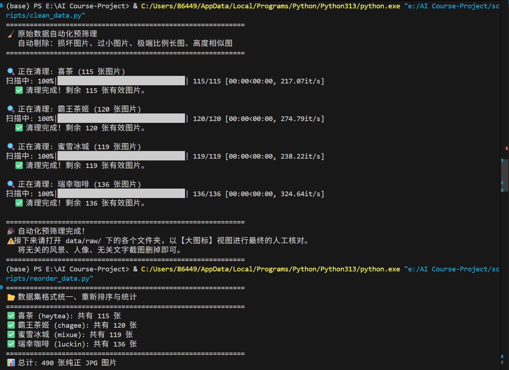{ width=90% }

#### 数据集划分

清洗完成的数据按照 70%:15%:15% 的比例随机划分为训练集、验证集和测试集。划分过程使用固定的随机种子（seed=42）以保证实验的可复现性。

#### 数据预处理与增强

为了在有限的数据量下提高模型的泛化能力，本文对训练集采用了丰富的在线数据增强策略，具体如表2所示。

表2 训练集数据增强策略

| 增强操作 | 参数 | 目的 |
|---------|------|------|
| Resize + RandomCrop | 256→224 | 引入随机位移和缩放 |
| RandomHorizontalFlip | p=0.5 | 模拟水平翻转 |
| RandomRotation | ±15° | 模拟拍摄角度偏转 |
| ColorJitter | 亮度/对比度/饱和度±0.2 | 模拟不同光照条件 |
| RandomAffine | 平移±10% | 模拟位置偏移 |
| Normalize | ImageNet均值/标准差 | 与预训练模型一致 |

验证集和测试集仅进行 Resize 到 224×224 和 ImageNet 归一化，不做任何随机增强，以确保评估结果的确定性。

### （二）实验设置

#### 实验环境

本文的实验环境配置如表3所示。所有代码基于 PyTorch 深度学习框架[8]开发。

表3 实验环境配置

| 项目 | 配置 |
|------|------|
| CPU | AMD Ryzen 9 8950HX |
| GPU | NVIDIA GeForce RTX 5070 Ti |
| 操作系统 | Windows |
| Python 版本 | 3.10+ |
| 深度学习框架 | PyTorch 2.7.0 |
| CUDA 版本 | 12.8 |

#### 超参数设置

本文两个模型的训练超参数设置如表4所示。

表4 训练超参数设置

| 超参数 | 值 | 说明 |
|--------|------|------|
| 批次大小（Batch Size） | 32 | 每批训练样本数 |
| 初始学习率 | 0.001 | Adam 优化器 |
| 权重衰减（Weight Decay） | $1 \times 10^{-4}$ | L2 正则化系数 |
| 最大训练轮数 | 50 | 受早停机制约束 |
| 标签平滑系数 $\epsilon$ | 0.1 | Label Smoothing[2] |
| Mixup 参数 $\alpha$ | 0.2 | Beta 分布参数[3] |
| 早停耐心值 | 10 | 验证集无提升的容忍轮数 |
| 输入图片尺寸 | 224×224 | ResNet 标准输入 |
| 学习率调度 | CosineAnnealing | $T_{max}$=50, $\eta_{min}$=$10^{-6}$[4] |

#### 对照实验设计

本文设计了两组对照实验：

**SimpleCNN（基线模型）**：从零搭建的三层 CNN，包含 3 个卷积块（Conv2d→BatchNorm[5]→ReLU→MaxPool2d）、自适应平均池化和两层全连接分类头（含 Dropout[6]）。总参数量约 60 万，全部从随机初始化开始训练。

**ResNet50（迁移学习模型）**：加载 ImageNet V2 预训练权重[1][10]，冻结 conv1、layer1、layer2 的参数，解冻 layer3 和 layer4 进行微调，替换全连接层为 Dropout(0.3)→Linear(2048, 4)。总参数量约 2,356 万，其中可训练参数约 1,486 万。

两个模型使用完全相同的数据增强、损失函数、优化器和训练策略，以保证对比的公平性。

## 6. 实验结果与分析

### （一）定量评估

#### 训练曲线

图2 和图3 分别展示了 SimpleCNN 和 ResNet50 在训练过程中的损失函数和准确率变化曲线。

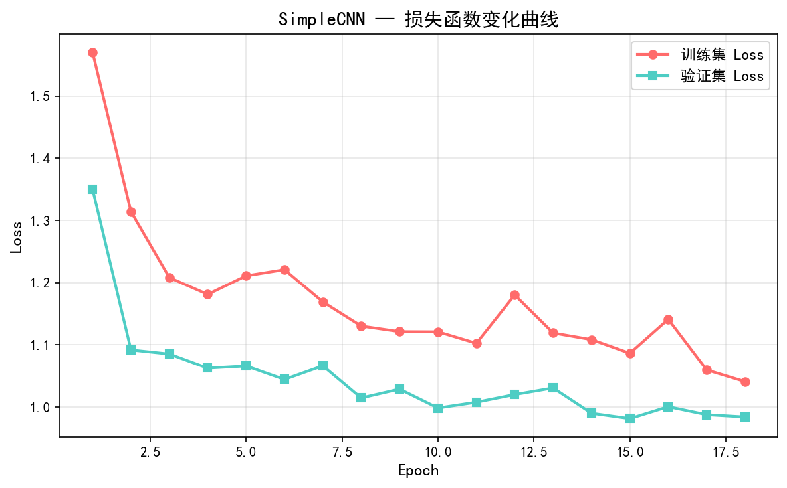{ width=70% }

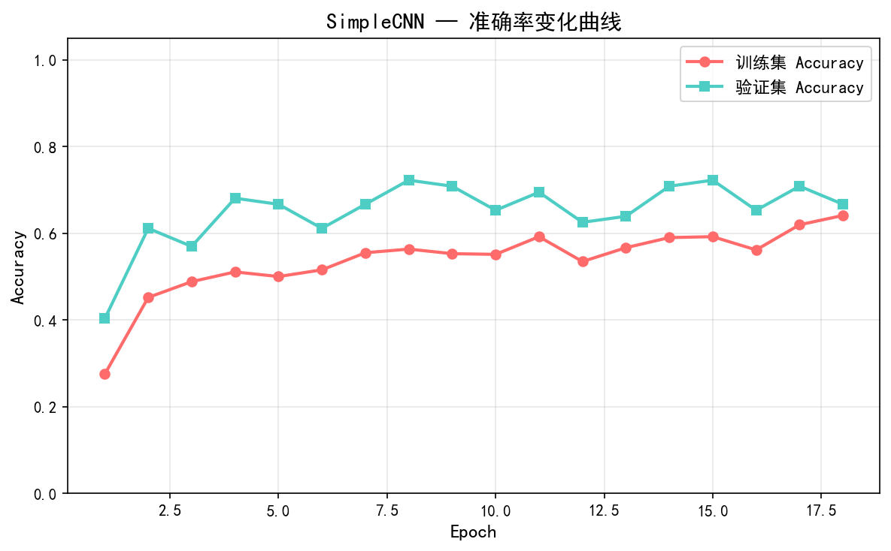{ width=70% }

从 SimpleCNN 的训练曲线可以观察到：训练集损失持续下降，但验证集损失在约 15 轮后开始波动上升，训练集准确率与验证集准确率之间存在明显差距，表现出典型的过拟合特征。这说明仅靠约 60 万参数的浅层网络难以有效学习品牌 LOGO 的复杂视觉特征。

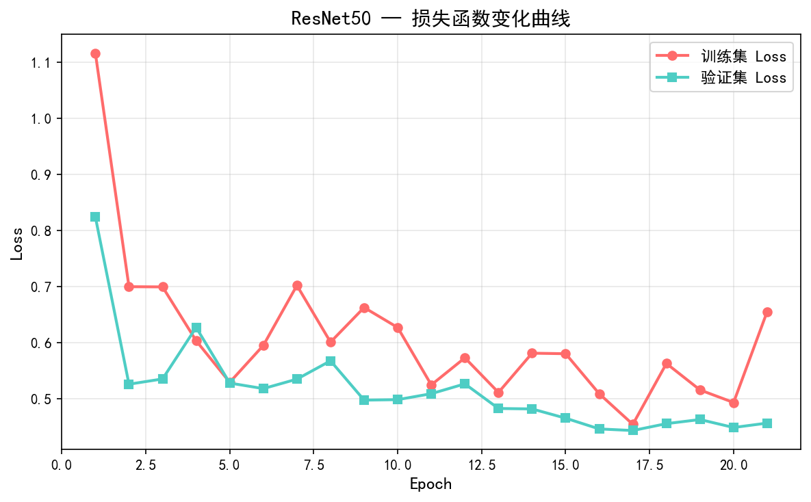{ width=70% }

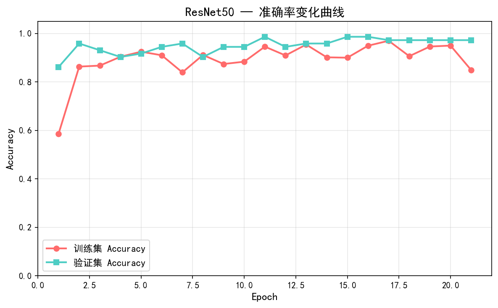{ width=70% }

相比之下，ResNet50 的训练曲线表现更加平稳。训练集和验证集的损失函数同步下降，准确率同步上升，训练-验证差距较小，说明迁移学习模型在本任务上具有更好的泛化能力。验证集准确率在前几轮就迅速攀升至 90% 以上，体现了 ImageNet 预训练权重的强大初始化效果。

#### 分类报告

表5汇总了两个模型在测试集（76 张图片）上的详细分类性能指标。

表5 两模型在测试集上的分类性能对比

| 品牌 | SimpleCNN Precision | SimpleCNN Recall | SimpleCNN F1 | ResNet50 Precision | ResNet50 Recall | ResNet50 F1 |
|------|:---:|:---:|:---:|:---:|:---:|:---:|
| 喜茶 | 0.4000 | 0.4444 | 0.4211 | 0.8947 | 0.9444 | 0.9189 |
| 霸王茶姬 | 0.6923 | 0.5000 | 0.5806 | 0.9474 | 1.0000 | 0.9730 |
| 蜜雪冰城 | 0.8000 | 0.8421 | 0.8205 | 0.9412 | 0.8421 | 0.8889 |
| 瑞幸咖啡 | 0.6087 | 0.6667 | 0.6364 | 0.9048 | 0.9048 | 0.9048 |
| **宏平均** | **0.6253** | **0.6133** | **0.6146** | **0.9220** | **0.9228** | **0.9214** |
| **整体准确率** | | | **0.6184** | | | **0.9211** |

从表5中可以得出以下分析：（1）ResNet50 在所有品牌上的各项指标均大幅优于 SimpleCNN，整体准确率提升了 30.27 个百分点（61.84% → 92.11%）。（2）SimpleCNN 对喜茶识别最差（F1=0.42），可能是因为喜茶 LOGO 以简洁线条为主，缺乏色彩和纹理特征，浅层 CNN 难以捕捉。（3）SimpleCNN 对蜜雪冰城识别最好（F1=0.82），蜜雪冰城的"雪王"形象具有独特的色彩和形状，即使浅层网络也能有效区分。（4）ResNet50 对霸王茶姬识别最准（F1=0.97，Recall=1.00），得益于预训练模型对复杂纹理和图案的理解能力[1]，霸王茶姬的东方风格 LOGO 被完美识别。

#### 模型性能对比

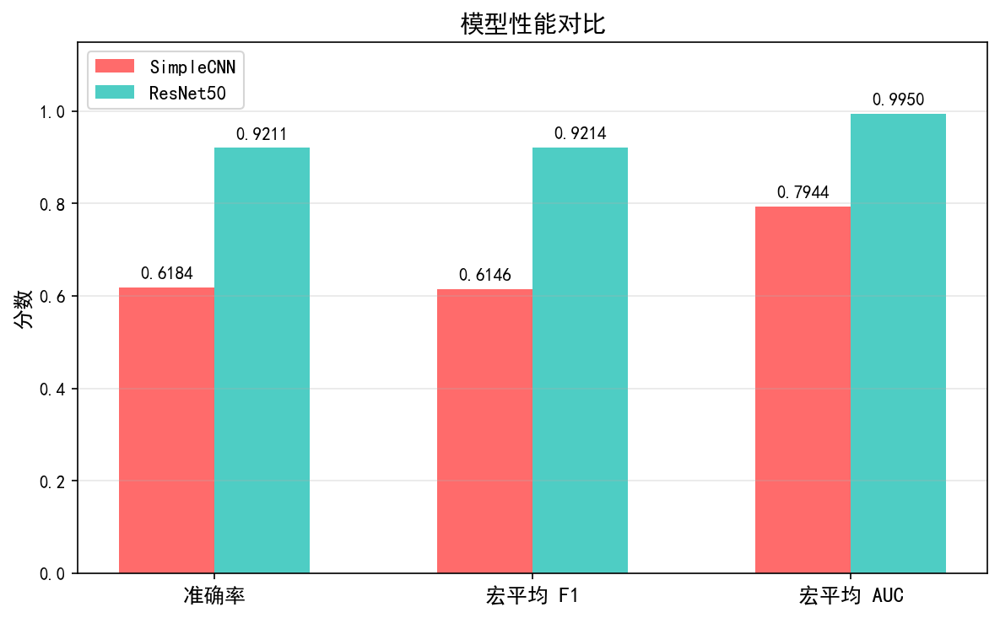{ width=70% }

#### 混淆矩阵

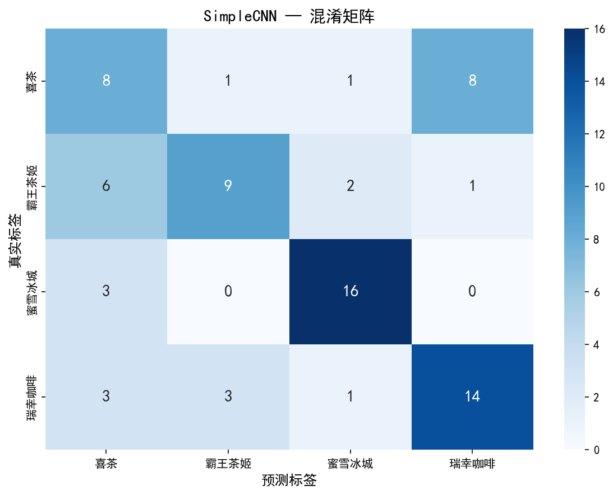{ width=60% }

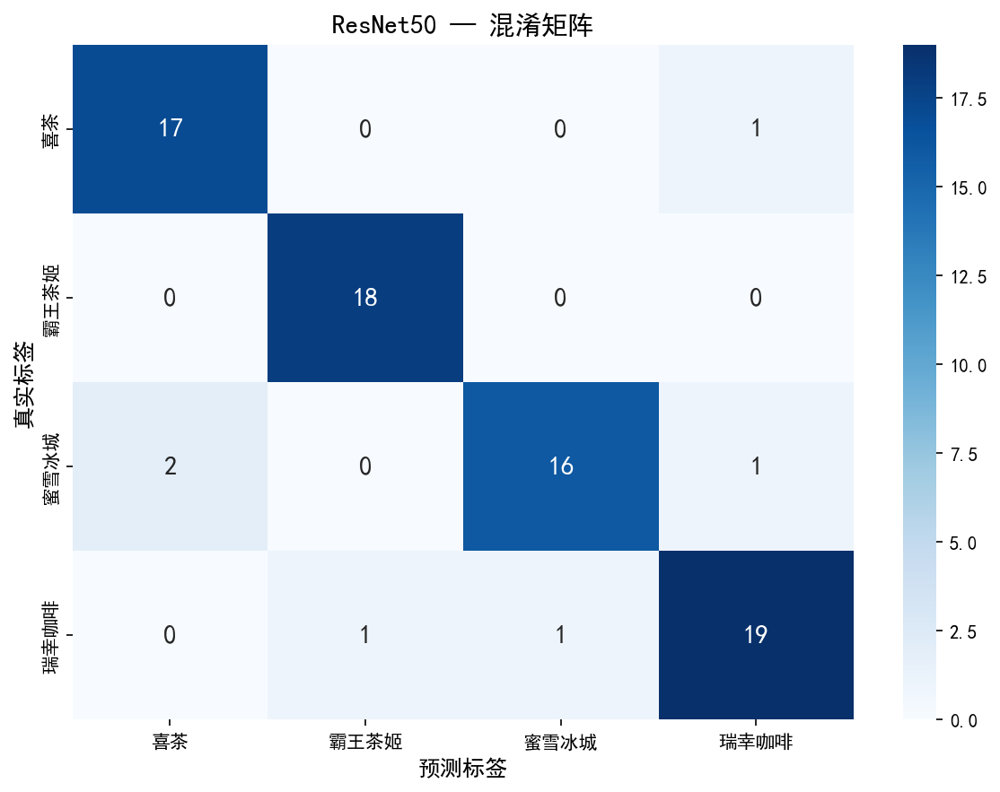{ width=60% }

从混淆矩阵可以看出，SimpleCNN 存在大量的跨类混淆，特别是喜茶和霸王茶姬之间、喜茶和瑞幸之间的混淆较为严重。而 ResNet50 的混淆矩阵几乎是对角矩阵，仅有少量蜜雪冰城样本被误分类。

#### ROC 曲线与 AUC 值

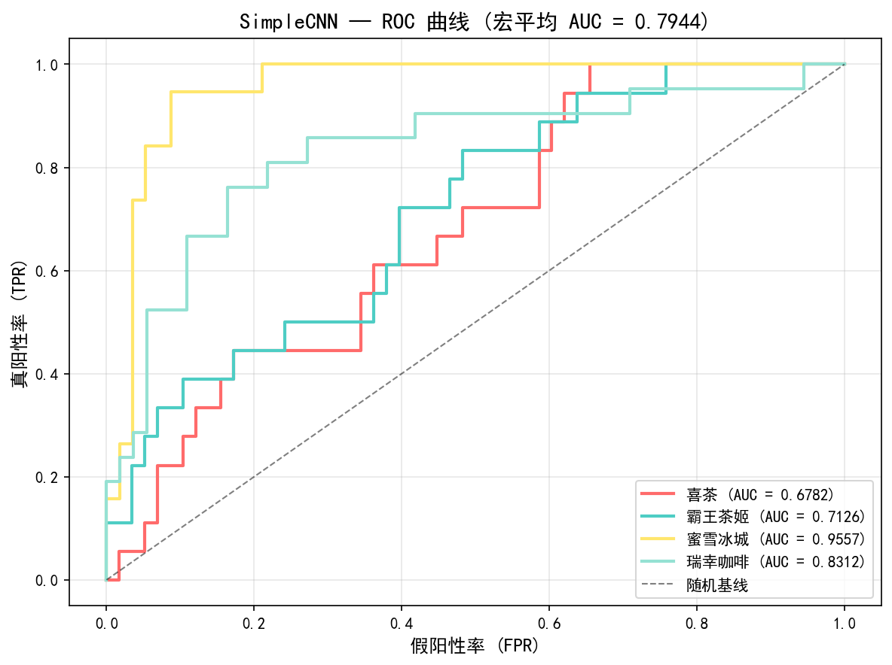{ width=65% }

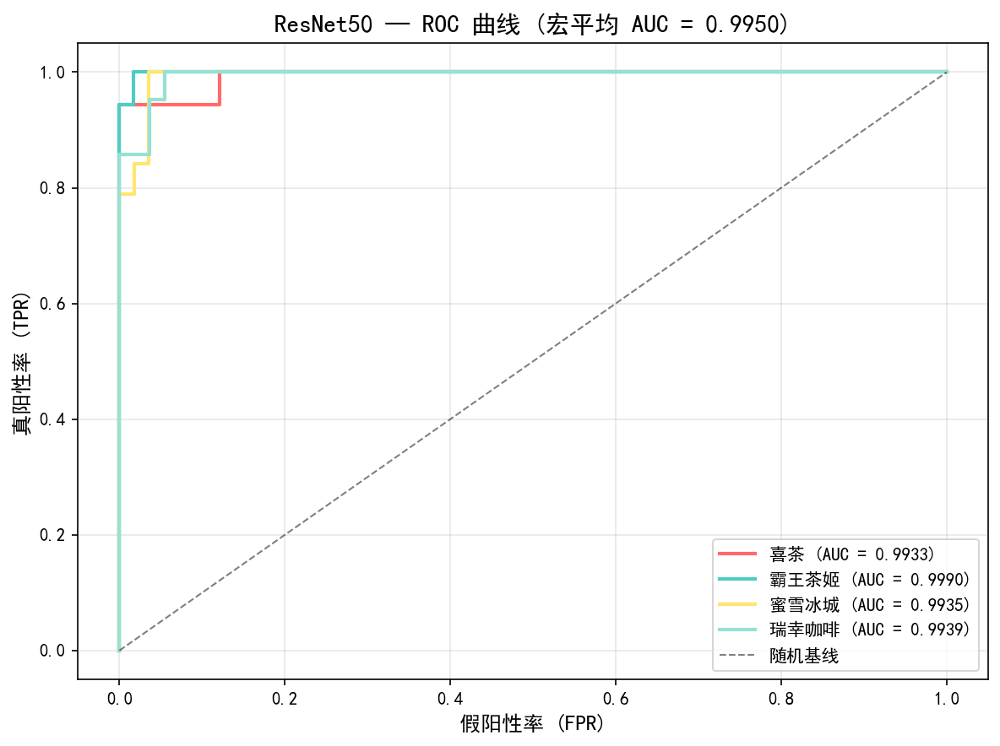{ width=65% }

ResNet50 各类别的 AUC 值均接近 1.0，ROC 曲线紧贴左上角，表明模型具有优秀的分类判别能力。SimpleCNN 的 ROC 曲线则更远离左上角，AUC 值相对较低，尤其是喜茶类别。

### （二）定性评估

#### 正确预测样例

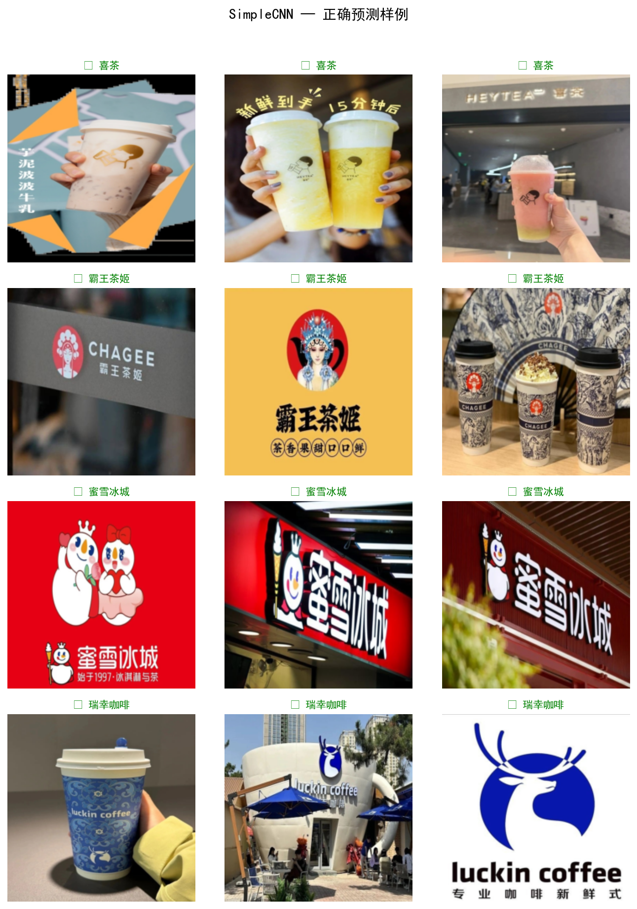{ width=85% }

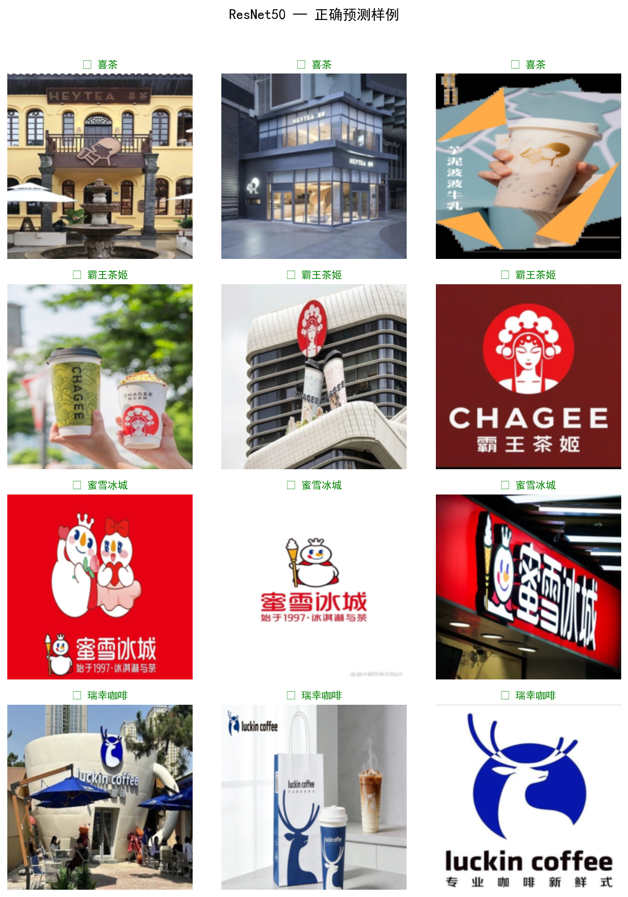{ width=85% }

#### 错误案例分析

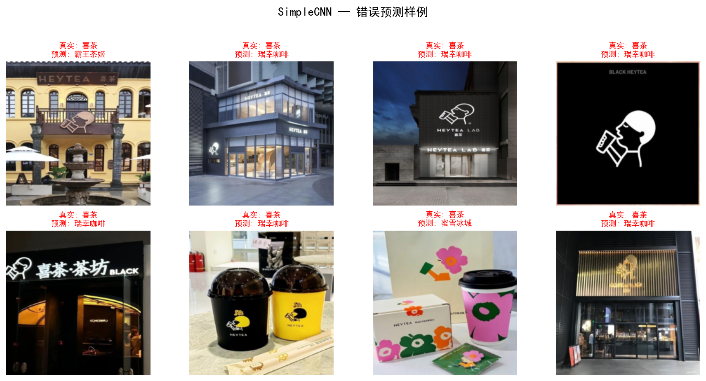{ width=85% }

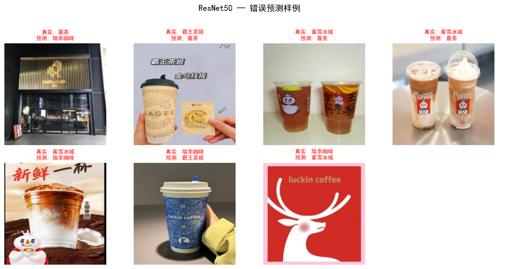{ width=85% }

通过分析错误预测案例，可以发现以下规律：（1）**背景干扰**，部分错误预测发生在 LOGO 面积较小、背景复杂的图片中，模型可能受到了背景元素的干扰；（2）**非标准变体**，一些品牌在不同场景下使用了不同的 LOGO 变体（如简化版、单色版），与训练集中的标准 LOGO 差异较大；（3）**相似配色**，部分品牌的配色方案存在一定相似性（如喜茶和瑞幸都使用了较多的白色和简洁线条），容易导致浅层网络的混淆。

### （三）代码运行截图

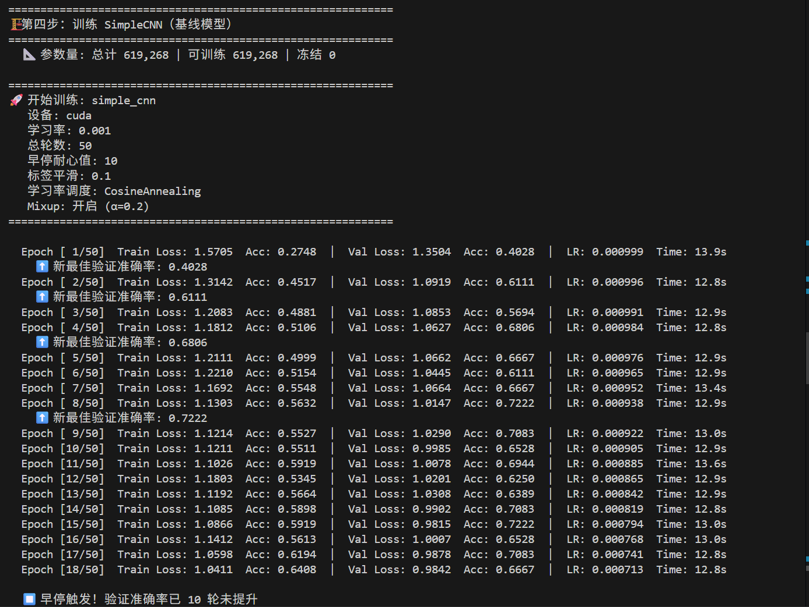{ width=90% }

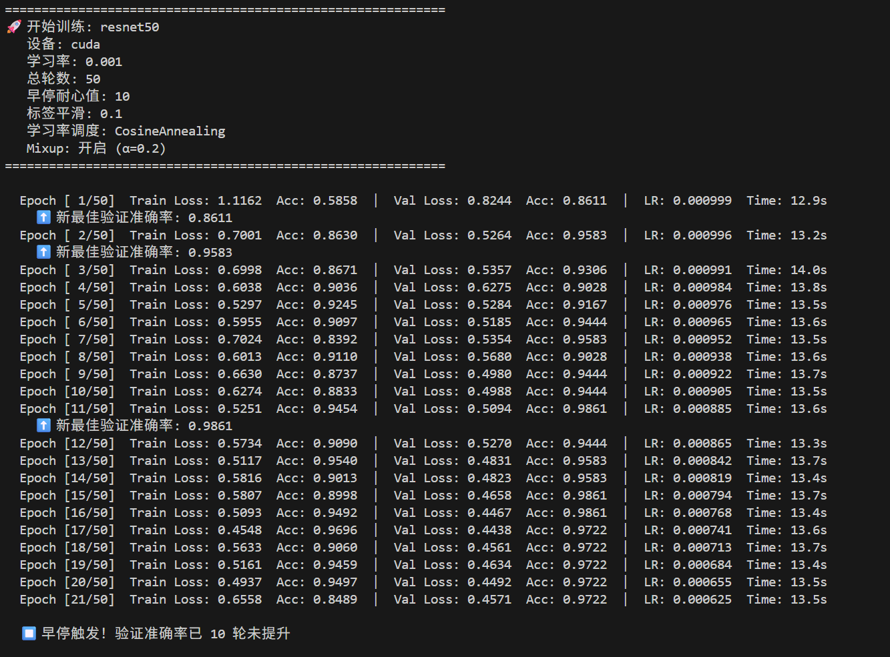{ width=90% }

### （四）GUI 图形化界面演示

为了更直观地验证模型的泛化能力与实际应用价值，本文基于 Python Tkinter 库和 tkinterdnd2 扩展构建了双模型对比测试 GUI 客户端。该界面支持用户直接将图片拖拽到窗口中，系统会同时调用 SimpleCNN 和 ResNet50 两个模型进行预测，并排显示各品牌的预测概率，方便直观地对比两个模型的表现差异。

从以下测试截图可以看出，在面对互联网上随机找到的新图片时，ResNet50 仍然能以极高的置信度给出正确预测，而 SimpleCNN 在部分场景下表现挣扎，验证了迁移学习模型在实际应用中的优越性。

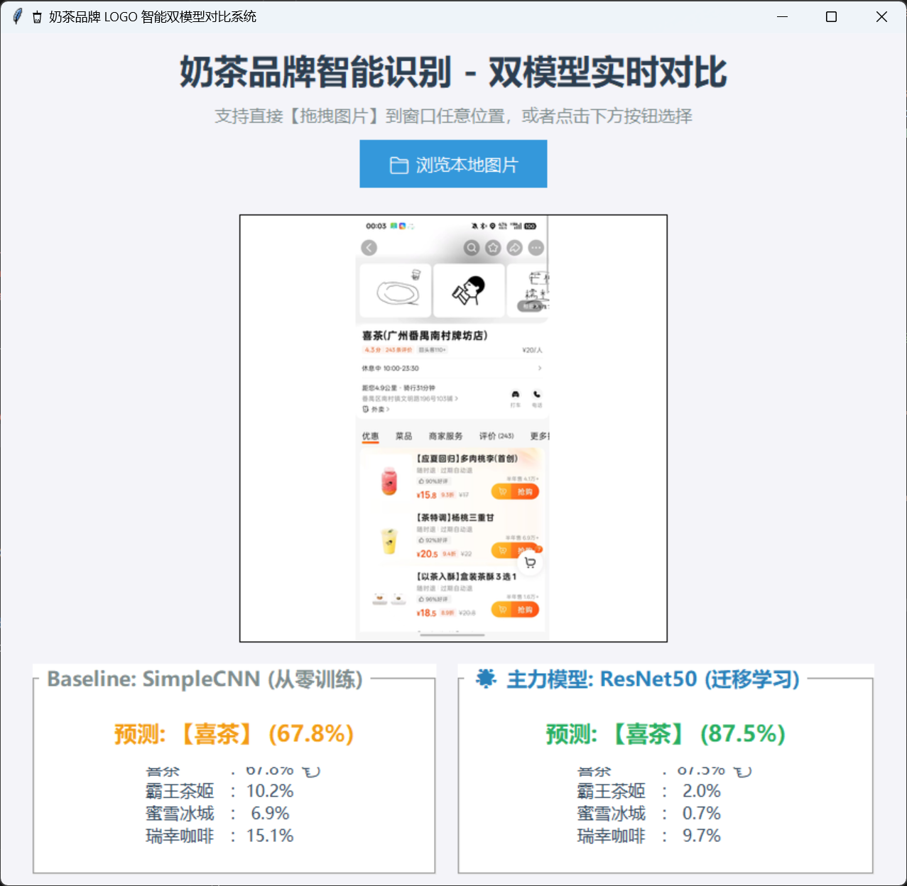{ width=75% }

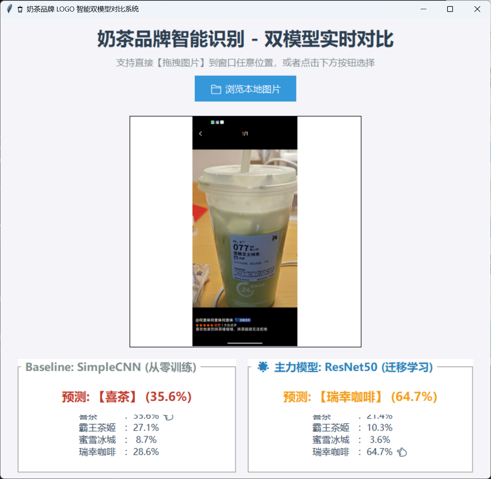{ width=75% }

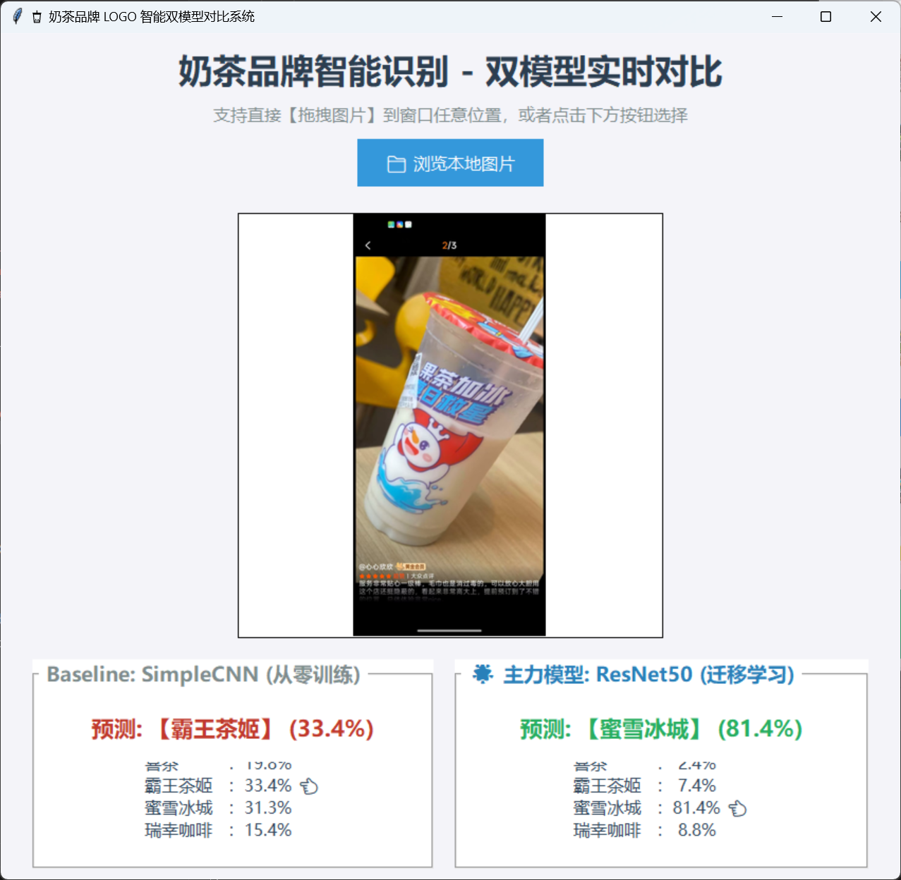{ width=75% }

### （五）讨论

本文的实验结果清晰地验证了以下几个关键结论：

第一，迁移学习在小规模数据集上具有压倒性优势。ResNet50 相比 SimpleCNN 的准确率提升了 30 个百分点以上（61.84% → 92.11%），这一差距主要源于 ImageNet 预训练权重[1]提供了丰富的底层和中层视觉特征，使模型无需从零学习这些通用特征，可以将有限的训练数据和计算资源集中用于学习任务特定的高层语义特征。

第二，部分微调策略是有效的折中方案。本文冻结了 ResNet50 的 conv1 至 layer2（保留通用底层特征），解冻 layer3 和 layer4（适应 LOGO 识别的高层特征）。这一策略比纯特征提取（只训练分类头）更灵活，又比全量微调更不容易过拟合，适合本文数据量有限的场景。

第三，训练优化技巧的组合效果显著。Label Smoothing[2]防止了模型过度自信，Mixup[3]有效扩充了训练数据的多样性，CosineAnnealing[4]提供了平滑的学习率衰减，Early Stopping 防止了过拟合。这些技巧的综合运用对最终性能有积极贡献。

第四，数据质量和多样性是制约性能的关键因素。尽管 ResNet50 达到了 92.11% 的准确率，但仍有约 8% 的误分类，主要集中在背景复杂或 LOGO 变体较大的样本上。进一步提升性能的关键在于扩大数据集规模、增加数据多样性（如更多拍摄角度、光照条件、遮挡情况等）。

## 7. 结论

本文以饮料品牌 LOGO 智能分类为研究课题，完整实现了从数据采集、模型训练到可视化评估和 GUI 演示的端到端深度学习系统。主要工作和结论如下：

（1）**自建数据集**：通过百度图片爬虫、微信公众号、视频截图和实物拍摄等多种途径，构建了包含喜茶、霸王茶姬、蜜雪冰城和瑞幸咖啡四个品牌共约 490 张 LOGO 图片的数据集，并通过自动化预筛和人工审核保证了数据质量。

（2）**模型对比实验**：实现了从零搭建的 SimpleCNN 基线模型和基于 ImageNet 预训练的 ResNet50 迁移学习模型的对比实验。实验结果表明，迁移学习模型将分类准确率从 61.84% 大幅提升至 92.11%，宏平均 F1 值从 0.6146 提升至 0.9214，充分验证了迁移学习在小规模数据集上的显著优势。

（3）**训练优化**：综合运用了标签平滑、Mixup 数据增强、余弦退火学习率调度和早停机制等多种训练优化策略，有效提升了模型的泛化性能。

（4）**GUI 演示应用**：开发了基于 Tkinter 的双模型对比 GUI 应用，支持拖拽图片进行实时预测，直观展示了模型的实际应用效果。

**未来展望：** 本文的工作仍存在一些可以改进的方向：（1）扩大数据集规模，增加更多品牌类别和更丰富的拍摄场景；（2）尝试更先进的模型架构（如 Vision Transformer）；（3）引入数据不均衡处理策略（如过采样、类别加权）；（4）将模型部署为 Web 服务或移动端应用，进一步探索实际应用场景。

## 8. 参考文献

[1] He K, Zhang X, Ren S, et al. Deep Residual Learning for Image Recognition[C]. Proceedings of the IEEE Conference on Computer Vision and Pattern Recognition (CVPR), 2016: 770-778.

[2] Szegedy C, Vanhoucke V, Ioffe S, et al. Rethinking the Inception Architecture for Computer Vision[C]. Proceedings of the IEEE Conference on Computer Vision and Pattern Recognition (CVPR), 2016: 2818-2826.

[3] Zhang H, Cisse M, Dauphin Y N, et al. mixup: Beyond Empirical Risk Minimization[C]. International Conference on Learning Representations (ICLR), 2018.

[4] Loshchilov I, Hutter F. SGDR: Stochastic Gradient Descent with Warm Restarts[C]. International Conference on Learning Representations (ICLR), 2017.

[5] Ioffe S, Szegedy C. Batch Normalization: Accelerating Deep Network Training by Reducing Internal Covariate Shift[C]. International Conference on Machine Learning (ICML), 2015: 448-456.

[6] Srivastava N, Hinton G, Krizhevsky A, et al. Dropout: A Simple Way to Prevent Neural Networks from Overfitting[J]. Journal of Machine Learning Research, 2014, 15(1): 1929-1958.

[7] Krizhevsky A, Sutskever I, Hinton G E. ImageNet Classification with Deep Convolutional Neural Networks[C]. Advances in Neural Information Processing Systems (NeurIPS), 2012: 1097-1105.

[8] PyTorch Documentation. https://pytorch.org/docs/stable/index.html

[9] 阿斯顿·张, 李沐等. 动手学深度学习[M]. 人民邮电出版社, 2023.

[10] torchvision.models — PyTorch Documentation. https://pytorch.org/vision/stable/models.html

## 9. GitHub 源代码链接（加分项）

**[待填写 GitHub 仓库链接]**

本项目的完整代码已上传至 GitHub 仓库，包含详细的 README 文件，说明了环境配置、依赖安装、数据准备和运行步骤，确保他人能够复现本文的实验结果。项目采用模块化设计，代码结构清晰，各模块（数据处理、模型定义、训练、评估、预测、GUI）独立且有详细注释。

## 10. 自构数据集说明（加分项）

本文所使用的饮料品牌 LOGO 数据集完全由本人自行构建，未使用任何现成的公开数据集。数据集的构建过程包含以下几个阶段：

**（1）自动采集：** 编写 Python 爬虫脚本，使用百度图片搜索 API 按品牌关键词（如"喜茶LOGO""霸王茶姬标志"等）自动下载图片，每个品牌使用 5 组不同的关键词以增加数据多样性。

**（2）多源补充：** 除爬虫外，本人还从微信公众号文章中搜索下载品牌相关图片，从哔哩哔哩品牌相关视频中截取含有 LOGO 的帧画面，以及使用手机在实体店铺拍摄品牌 LOGO 照片。多源采集确保了数据的多样性和真实性。

**（3）自动预筛：** 编写基于感知哈希（pHash）的去重脚本，自动剔除损坏文件、过小图片（小于100px）、极端比例图片（大于4:1）和高度相似的重复图片。

**（4）人工审核：** 以大图标视图逐个文件夹进行最终的人工审核，确保每张保留的图片确实包含目标品牌的 LOGO 元素。

**（5）格式统一：** 将所有图片统一转换为 JPEG 格式并按顺序编号（0000.jpg, 0001.jpg, ...），便于管理和训练。

最终数据集包含 4 个品牌共约 490 张高质量 LOGO 图片，涵盖了标准 LOGO、门店招牌、饮品杯身、宣传海报等多种场景，具有一定的独特性和实用价值。

